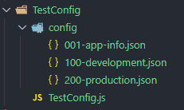
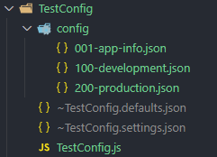

# Server-Kit Sample: TestConfig

***A simple project that demonstrates some aspects of server configuration.***


The TestConfig project has no services or views.
It initializes the server using configuration files stored in the `config` folder.
It also appends some custom fields to the server configuration.
After starting the server, it immediately shuts down the server and exits the process.


TestConfig Folder Contents
---------------------------------------------------------------------



The project starts out with a very simple structure.
It has a `config` folder containing some server configuration files
and the main entry point file for the project `TestConfig.js`.


TestConfig Server Code
---------------------------------------------------------------------

```javascript
// Load the Server-Kit Library.
const SERVER_KIT = require( '@liquicode/lib-server-kit' );

// Server-Kit Initialization Options.
let timestamp = new Date(); // We are going to add some timestamp data to the server configuration.
let server_options = {
	defaults_filename: '~TestConfig.defaults.json',  // Writes server defaults to a file.
	settings_filename: '~TestConfig.settings.json',  // Writes server settings to a file.
	config_path: 'config',                           // Merge all config files in path.
	services_path: '',                               // Path to the application services folder.
	Settings:                                        // Server settings (overrides config folder).
	{
		AppInfo: {
			timestamp: timestamp.toString(),         // Add some custom fields that get saved to the config.
			timestampz: timestamp.toISOString(),     // Custom fields are available to all services.
		},
	},
};

// Create a new server.
const Server = SERVER_KIT.NewServer( 'TestConfig', __dirname, server_options );

// Run the server.
( async function Startup()
{
	await Server.Initialize();
	await Server.Startup();
	await Server.Shutdown();
} )();
```


### Server Configuration

The server obtains configuration settings from two places.
This first comes from the configuration files found in the `config` folder.
These files are read (in alphabetical order) and are merged together to form the initial server configuration.
We are also passing in configuration values via `server_options.Settings`.
These values are merged into the server configuration and override any values assigned from the configuration files.

`Settings.AppInfo` is a predefined section of the server configuration and here we are adding a couple of fields to it.
This will have no effect on server operation but these fields will be visible to all application services running on the server.

Note that there is actually another opportunity to modify the server configuration after the server has been created.
Server has a `Settings` object which contains the full configuration and it is available to all server components.
You can modify the configuration settings here, but you must do so before the call to `Server.Initialize()`.
It is inadvisable to modify any configuration settings after Initialize has been called.

```javascript
const Server = SERVER_KIT.NewServer( 'TestConfig', __dirname, server_options );
// Last chance to config!
Server.Settings.AppInfo.version = '1.0.0'; // Update the version number.
await Server.Initialize();
```


Running the TestConfig Server
---------------------------------------------------------------------

The main entry point for the project is `TestConfig.js`.
You can run the project like this:
```bash
node TestConfig.js
```
You will see a bunch of log output from the server and then the project will exit.


### Log Output

```
| 03:50:06 | 0037 | T | Server initialized module [Log].
| 03:50:06 | 0038 | T | Wrote configuration defaults to file [~TestConfig.defaults.json].
| 03:50:06 | 0039 | T | Wrote configuration settings to file [~TestConfig.settings.json].
| 03:50:06 | 0039 | W | WARNING! The settings file [~TestConfig.settings.json] contains all of your server's private settings and keys. This file is generated to assist in documenting and debugging your server's configuration. DO NOT include this file in backups or in source code repositories.
| 03:50:06 | 0039 | D | Runtime environment set to: production
| 03:50:06 | 0041 | T | Server initialized service [Authentication].
| 03:50:06 | 0041 | T | Server initialized service [ServerAccounts].
| 03:50:06 | 0041 | T | Server initialized service [ServerManagement].
| 03:50:06 | 0041 | I | Server is initialized.
| 03:50:06 | 0041 | T | Server started service [Authentication].
| 03:50:06 | 0042 | T | Server started service [ServerAccounts].
| 03:50:06 | 0042 | T | Server started service [ServerManagement].
| 03:50:06 | 0042 | I | Server is running.
| 03:50:06 | 0042 | T | Server stopped service [Authentication].
| 03:50:06 | 0042 | T | Server stopped service [ServerAccounts].
| 03:50:06 | 0042 | T | Server stopped service [ServerManagement].
| 03:50:06 | 0042 | I | Server is stopped.
```

The log output details the initialization of the server and its components.
We also see log output detailing the shutdown of the server.

Log output is configurable and, shown here, displays the time, milliseconds, and severity of the log message.
From the output, we can determine that the server run took 5 miliiseconds and there were no errors.
It also didn't do anything either.


### Running Folder View

You will see two new files generated by Server-Kit:




### Server Generated Files

We are telling the server to generate two files for us (`~TestConfig.defaults.json` and `~TestConfig.settings.json`).
These files contain the versions of server configuration "before" and "after" all custom settings are applied.
The "defaults" file contains all of the settings defined by Server-Kit and all of their default values.
The "settings" file is the final version of the server configuration and the one that will be used during operation.
These files are generated when the server is created during the call to `SERVER_KIT.NewServer()`.

The purpose of these files is to assist you in developing and debugging your server configuration.
Their existence has no effect on server operation and it is not expected for them to be generated in production environments.
In fact, take special care when generating the "settings" file as it will
contain secrets such as server passwords and encryption keys.
You ***do not*** want to archive this file or store it in your source control repository.
Note the friendly warning in the log output when the server is generating the "settings" file.

These (and other) files are prefixed by a `~` for two reasons:
(1) To provide a visual distinction between your project files and files generated by Server-Kit.
(2) To exclude these files from the source control.
The root level `.gitignore` file contains the entry `~*` which instructs git to
ignore any file or folder which begins with a `~` character.
This is not a convention you are required to follow,
but it is supported by the server defaults and is used throughout the other samples.


